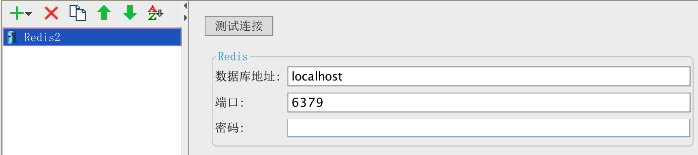
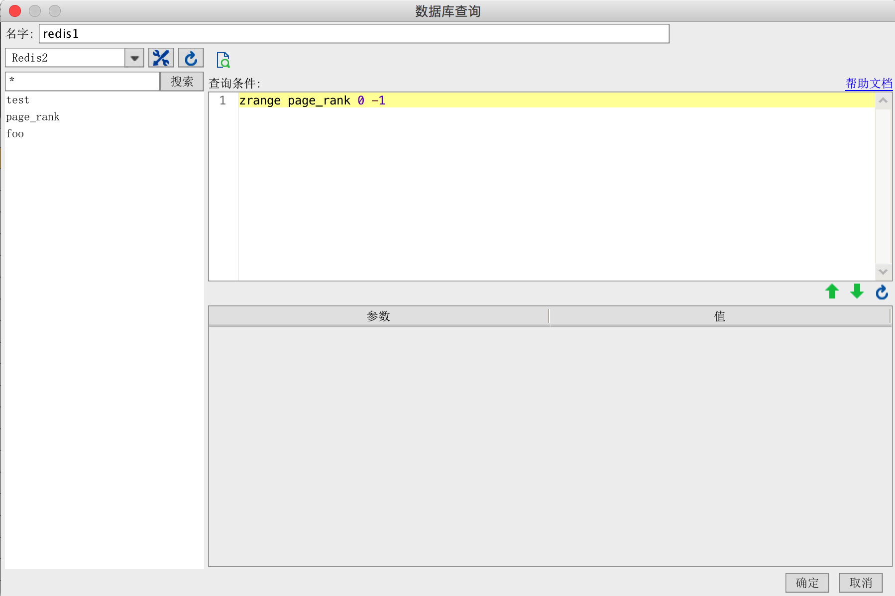
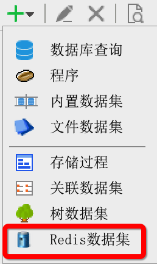

# 帆软报表连接redis缓存数据库插件
## 插件编译
将帆软报表安装目录下的相关jar包:

$installDir/fr-designer-core-8.0.jar

$installDir/fr-designer-chart-8.0.jar

$installDir/fr-designer-report-8.0.jar

$installDir/WebReport/WEB-INF/lib/fr-core-8.0.jar

$installDir/WebReport/WEB-INF/lib/fr-chart-8.0.jar

$installDir/WebReport/WEB-INF/lib/fr-report-8.0.jar

$installDir/WebReport/WEB-INF/lib/fr-platform-8.0.jar

$installDir/WebReport/WEB-INF/lib/fr-third-8.0.jar

拷贝到项目工程的lib/report目录下（如果没有该目录则自行新建）

然后执行ant命名来编辑插件包：
`ant -f build.xml jar`

## 插件安装
使用帆软设计器自带的插件管理器即可安装。
## 插件使用
### 新建数据连接
安装完插件后，在新建数据连接的地方可以看到Redis类型的数据连接，点击新建后可以看到如下的界面：

按实际的配置填写上即可。

### 新建数据集
在模板数据集添加的地方会出现Redis数据集，点击新建后会出现如下的界面，选择要查询的库名、表名并写上查询条件即可：

### 预览效果
原始数据：

设定查询条件后，就可以预览数据集结果了：

可以看到预览出来的数据里面，type字段的值都是ios。
